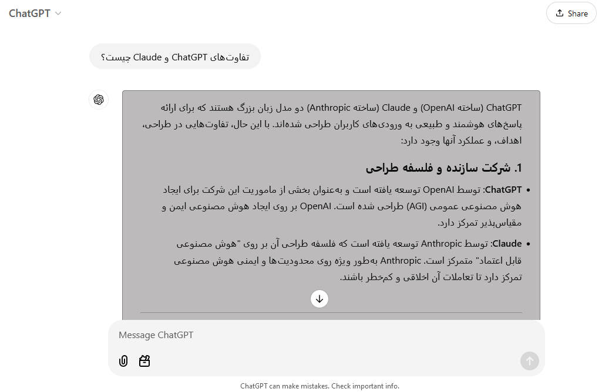

# ChatGPT RTL Enhancer

## Description

ChatGPT RTL Enhancer is a Firefox add-on designed to enhance the readability of ChatGPT responses for Persian and Arabic users. It ensures proper right-to-left (RTL) support and aligns mixed Persian-English texts for a visually appealing and structured display.

## Features

- **Right-to-left alignment**: Fixes alignment issues for Persian and Arabic text.
- **Improved readability**: Organizes mixed Persian-English text for better understanding.
- **Visual appeal**: Adds a clean and polished theme to ChatGPT messages.

## Installation

1. Visit the [ChatGPT RTL Enhancer page on Firefox Add-ons](https://addons.mozilla.org/en-US/firefox/addon/chatgpt-rtl-enhancer/).
2. Click **Add to Firefox** and follow the instructions to install the add-on.

## Screenshots

Here are some screenshots of ChatGPT RTL Enhancer in action:

## Project Link

You can find the project on Firefox Add-ons here: [ChatGPT RTL Enhancer](https://addons.mozilla.org/en-US/firefox/addon/chatgpt-rtl-enhancer/).

## Issues

If you encounter any issues or have feature requests, please report them in the [Issues](https://github.com/your-username/chatgpt-rtl-enhancer/issues) section of this repository.

## License

This project is licensed under the [MIT License](LICENSE).

---

Developed with ❤️ to make ChatGPT more accessible for Persian and Arabic users!
